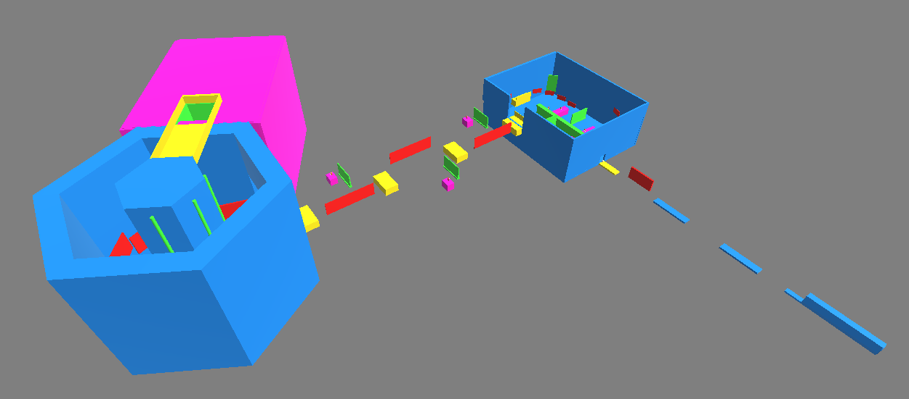
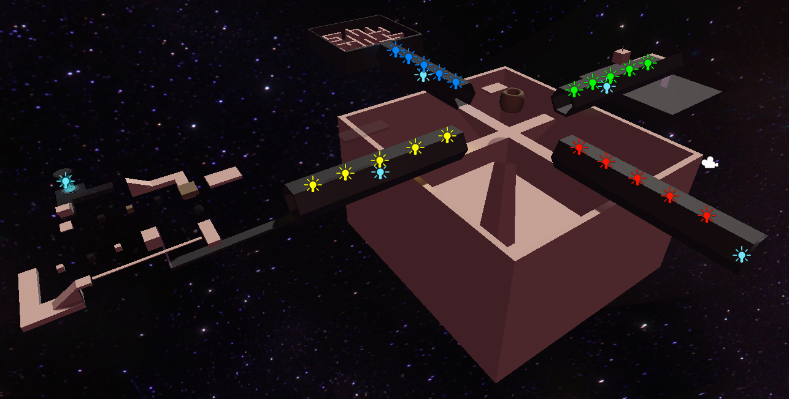

### One Gun Man
[One Man Gun Itch.io](https://johnnycode.itch.io/one-man-gun)
*Level Playthrough Coming Soon!*

My workload for this Project consisted of providing character models, a wide range of environmental assets and coloring them in a way that fits the games desired asthetic. I finished the concept and 3D models of the main character as well as a sentry robot NPC. I continued to self-learn and implement throughout the project, as well as provide team support to those who needed feedback or additional help in creating content. I have furthered my knowledge in topics such as color theory to better understand palettes and how to pair colors for more pleasing aesthetics and consistent design. I have developed a level that fully supports and utilizes our games mechanics, as well as UI elements such as health and energy bars. I created this level so that it is designed around our mechanics first to support interesting and engaging gameplay. This prototype level will set the standard for our games feel and can be further developed and refined into a fully composed level for our final game demo, which will be uploaded here when finished.

### ArcHive
* Itch.io & Level Playthrough Coming Soon!*

ArcHive was a group project but each person worked on their own level. The scope of the game was that the player worked for a company named ArcHive which had a system where the player could access a multiverse and restreive lost data files from virtual locations. Each person made their own interpretation of a level they wanted to design and mine was based on a broken space station. The player would enter a portal throught the main hub and be transported to the level of the corrisponding portal. You're goal was to retrieve all the files and then escape back out to continue onto the next file location. In this project I created the level shown below in Unity with ProBuilder. My method is to always build around the mechanics and the feel of the game first. Once prototyped I add additional obsticle and flesh out the world as deems neccisary for engaging gameplay.
