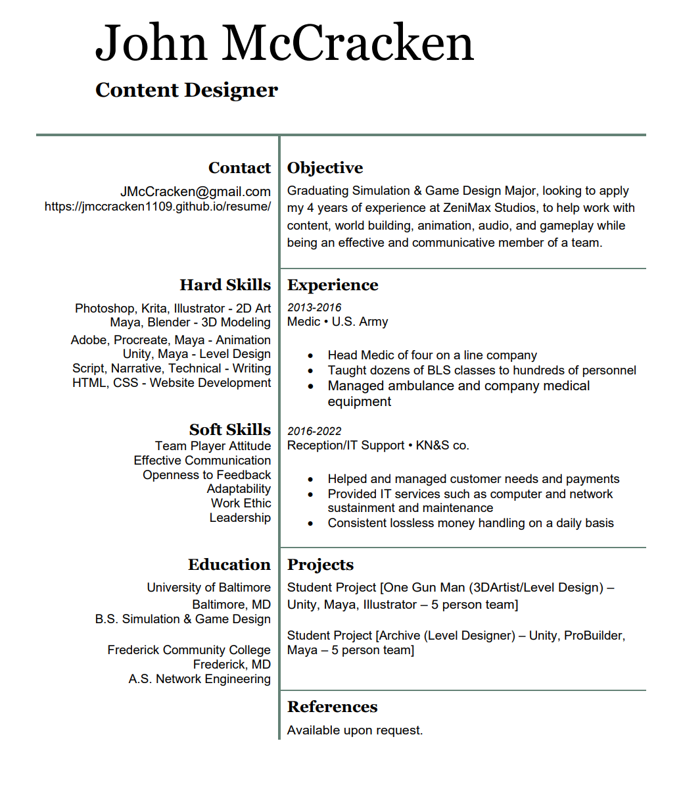

## Resume

## Interview Questions & Responses

#### Why do you want to work here?

Working in the gaming industry is nothing short of a dream come true. It brings me into an industry that I have been a part of for my whole life, even before I knew it existed. I told myself early on my goal was to work for a company that impacts players like Blizzard, Bethesda, or Obsidian. The magic that the industry has given me is what I want to be able to give back to the players. I want to give players an immersive experience that changes them for the better. Providing knowledge that inspires research and personal development, experiences that fill their hearts and bring communities together, and entertainment that lets them forget or even better cope with the difficulties they are facing in their current life. These things the industry has given me, and this is why I want to work for your company, to make the best games I can possibly make while giving back to the player.

#### What games are you playing?

Most recently, I just completed a game called Necesse which is a fun take on another game Terraria with its own spin. Since finishing that I have gone back and have been playing DayZ and Vampire Survivors as of late. DayZ is a unique game that is hard to deny how satisfying it is to loot zombie-infested towns and interact with others in-game with a survive-at-all-cost mentality. Sometimes DayZ can be just as psychologically demanding as it is skill and knowledge-based, which is hard to get in a lot of other games, just due to the sheer stakes involved. Vampire Survivors is the epitome of how simple gameplay combined with powerfully satisfying mechanics can drive a game to success even beyond some AAA titles with near infinitely more resources. The best thing about these games for me right now is that I am able to pick them up and digest as much or as little time as I want, giving me the ability to focus in education and career progression while still being able to play games that fulfill that need of escape in an effective manner.

#### How would you make the games you’re playing better?

First, DayZ. It’s difficult to make DayZ better in a major sense without losing the core feel of the game due to the engine it runs on and the code that is there. At first glance, someone might think it’s easy to pick out the problems with DayZ but without playing it, you would never know how much charm comes from what would generally be called shortcomings in other games like clunky gameplay and bugs. I would call this the Bethesda effect, sometimes clunky interactions can make for some of the most entertaining and memorable experiences in games. To improve upon the core game without losing its charm I would focus on what the core players enjoy about DayZ and expand upon it. This would be things like making Multiplayer a little easier to link up with friends by being able to add each other to a party and being able to see where they are but this again most likely takes away from the hardcore survival feel they are going for. Also adding refugee/survivor camps guarded by the military where a player can go and take a short breather from the harsh unforgiving world may be a nice addition. To make it so that the camps are not hunting grounds for snipers or other ill-willed players there could be a convoy system that allows the player to interact with military personnel there that will drop them off (spawn) at a random location with all their gear. Likewise, there could be roaming convoys that will also pick up players and bring them to the nearest camp. Based on the hardcore feel of the game this ease of movement could be offset by costing an amount of ammo, food, or even medical supplies in order to be transported.

Vampire Survivors is a game that is being updated and patched faster than I could put out ideas which is great to see a development team that is dedicated to their project and players. I would have to say that additional refinement to the hitboxes, preferably pixel-perfect hitboxes, would be a strong improvement. From a player’s point of view, the game feels that it registers hits on the player sometimes too soon or even too late which can be frustrating.

#### What’s the best game of all time and why?

My default answer always used to be Zelda: A Link to the Past because it's one of the first games I saw my brother beat and I went on to beat it as well when I got older. Obviously, it’s a fantastic Zelda game that gives from start to finish. It was my default answer in the past because of the guilt and stigma attached to my actual favorite game, but honestly, I would have to say World of Warcraft. More specifically, the second expansion Wrath of the Lich King. Whether you measure it by time spent, the impact made, or sheer enjoyment, World of Warcraft has given me a video game experience like no other. I’ve made long-lasting friends in which I’ve traveled cross-state on several occasions to meet and hang out with guild members. I have explored storytelling and game design in a way that I never knew I would have before.

#### What will you bring to the team? Why do we need you?

I bring an eclectic number of skills and knowledge that make me a vital part of an interdisciplinary team. I am able to work in an agile environment that requires a high-paced, multitasking talent to ensure the team succeeds and that all needs of its individuals are met. I am easy to work with, logical, and self-sustainable in this type of environment. I have a creative edge in being able to look at the world in ways many are not, such as looking up. It’s amazing how much more there is to life when simply looking up sometimes.

#### What’s your biggest weakness? Or, if I hired you, what would I regret about it in six months?

My biggest weakness is communication, but this is why I work on it constantly. I was a very quiet person growing up and my social skills lacked because of the loner I was back then. Nowadays, whether it be to others in a work environment, communicating with my wife and daughter, or simply chatting with a random person in the world, I am always trying to better my communication. Communication is an essential part of life and growing as a person, and I have grown a love for writing and storytelling because of it. Communication is the most powerful tool any team has, and it is vital in critical moments to be able to communicate effectively.

#### How do you feel about crunching?

I feel that crunch is unhealthy both physically and mentally but understand that on rare occasions that it could be necessary to a project, especially when it comes to supporting the individuals who play our games. I see crunch as a mishandling of time and scope of the project from managers and administrators higher up that is then passed on to the individuals who are putting the game together.

#### Okay, we’re going to work through a problem here…

Excellent, I’d love to see what you have for me. I would engage with a creative mind open about the problem trying to see it in an interesting way that allows me to utilize all my skills I can, to solve it. I know they are not expecting a masterpiece and more about how I work and what I am able to get done. My goal would be to show them that I can problem-solve efficiently with a creative twist.

#### Where do you want to be in five years?

At a minimum, I want to be skilled and knowledgeable enough to be running my own team. I have a desire to lead and feel that I can fulfill that role effectively and strategically. Before then I want to learn everything I can within my discipline to become the best game developer I can be and then pass that on to my team.

#### What game would you make if money were no object?

An open-world zombie survival craft MMO with massive scale and detail. I want a living breathing world that is some years after a zombie apocalypse. Wildlife is still around, plants are overtaking what the lack of human populations no longer uses and there are zombies of many different species. The storyline consists of a CRISPR-based life longevity/telomere research company that had a bad batch of product get released to the public. It altered their DNA in such a way they stopped aging but the virus hijacked the individual's brain. It's then sole goal is to feast as a way of sustenance and survival through spreading the infection. The player would have to craft, find shelter and sustain with what food and water they can. This would be a gamified reality in that the game would feel as real as possible, using reasonable crafting and collections methods but in a way that is simplified enough to make it not too daunting to the player. The world map would be the world itself but altered to this other branch of reality. There would be smaller towns and refugee camps that are scattered through the world wherever anyone could gather together and defend a location. There would be bandits and others that have no intention of cooperating in the ways of the time before the apocalypse. Zombies would only die if properly disposed of, such as destroying the brain. This also goes for a player who dies in the world and the brain is not destroyed. They will come back as a zombie in the world. The player is randomly spawned in the world or in the general vicinity of certain major locations. Base building will be extensive and prefab buildings are available for occupation.

#### What do you do on your own time to extend your skills?

When developing my own skills, I like to work on something that interests me and look up things as I run into obstacles. I like to test things as I go and figure things out on my own if I can with the resources I have, but will ask for help when in need before I let anything get stagnant.

#### Do you have any questions?

Do you provide a relocation package?

How does the company see remote work and is that something that is available to this position, if even a couple of days a week?

What makes an employee promotable in the eyes of the company?

What skill-based training does the company provide?

Does the company offer higher education packages or tuition assistance?

What kind of time off benefits does the company provide?
